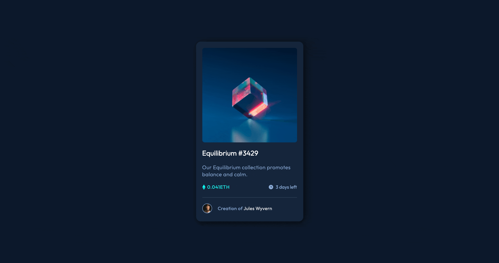

# Frontend Mentor - NFT Preview Card Component

## Overview

This project is from series of projects offered by Frontend Mentor, with the intention of helping individuals grow into well-rounded developers. These challenges provide design style sheets, a few production images, and the rest is up to the programmer to complete the challenge. There are no restrictions on how one finishes a project, and instead of following a tutorial step-by-step, these projects allow one to go through the processes used by programmers in professional settings.

## The challenge

Your challenge is to build out this preview card component and get it looking as close to the design as possible. You can use any tools you like to help you complete the challenge. So if you've got something you'd like to practice, feel free to give it a go. Your users should be able to:

- View the optimal layout depending on their device's screen size
- See hover states for interactive elements

Read More Here: [Frontend Mentor NFT Challenge](https://www.frontendmentor.io/challenges/nft-preview-card-component-SbdUL_w0U)

## Deployed Project

https://nifty-murdock-d18e1c.netlify.app/
